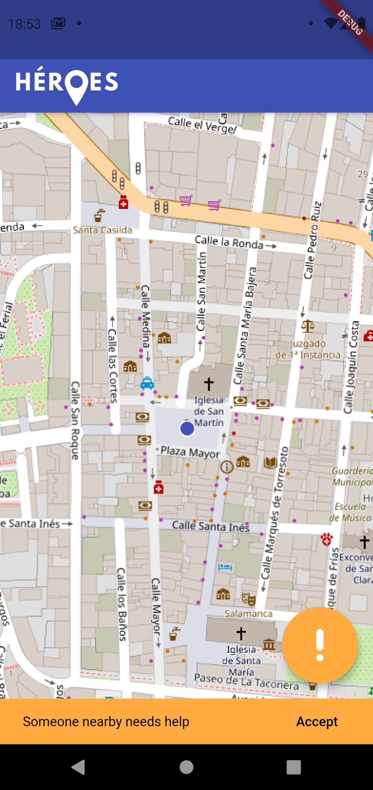
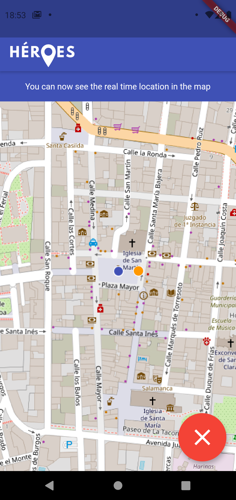

# Trabajo de Fin de Grado: _Héroes_

### Autor: Alejandro Menor Molinero

### Tutor: Juan Julián Merelo Guervós

---

  

La inseguridad en la vía pública, especialmente de las grandes ciudades, es un problema que muchas personas, sobre todo las mujeres, sufren cada día.
En mayor o menos medida nos podemos sentir vulnerables en la calle y nos gustaría estar acompañados. Héroes es una aplicación que permite conectar con personas
cercanas dispuestas a ayudar en muy poco tiempo.

Para esto se ha implementado un servicio de geolocalización escalable con NodeJS, utilizando como infraestructura Redis y MongoDB, además de una aplicación
móvil con Flutter. El sistema permite alertar a personas cercanas, permitiéndolas seguir en tiempo real la ubicación de la víctima.

  
  &nbsp;
  &nbsp;
  &nbsp;
  &nbsp;
  

---

La documentación de este proyecto está realizada con `LaTeX`, por lo
tanto para generar el archivo PDF necesitaremos instalar `TeXLive` en
nuestra distribución.

Una vez instalada, tan solo deberemos situarnos en el directorio `doc` y ejecutar:

`$ pdflatex proyecto.tex`

Seguido por

    bibtex proyecto

y de nuevo

    pdflatex proyecto.tex

O directamente

    make
